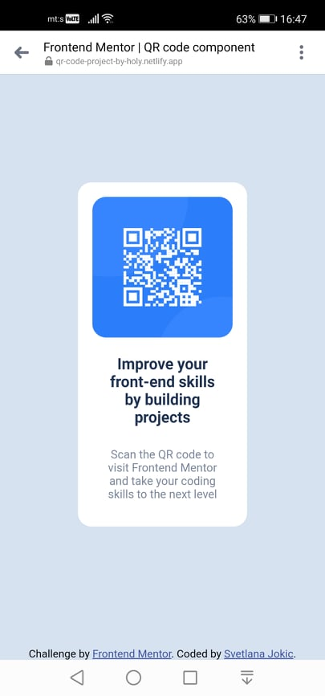

# Frontend Mentor - QR code component solution

This is a solution to the [QR code component challenge on Frontend Mentor](https://www.frontendmentor.io/challenges/qr-code-component-iux_sIO_H). Frontend Mentor challenges help you improve your coding skills by building realistic projects.

## Table of contents

- [Overview](#overview)
  - [Screenshot](#screenshot)
  - [Links](#links)
- [My process](#my-process)
  - [Built with](#built-with)
  - [What I learned](#what-i-learned)
  - [Continued development](#continued-development)
- [Author](#author)
- [Acknowledgments](#acknowledgments)

## Overview

Built Qr code, with few changes in HTML5 and CSS3. Body is centered. This project is so good to practice postioning of content on your page.

### Screenshot




### Links

- Solution URL: [from gitHub](https://github.com/Holllyyyy/qr-code)
- Live Site URL: [from netlify](https://qr-code-project-by-holy.netlify.app/)

## My process

I started with writing basic HTML where I just added couple of divs. After it I moved on my style. I make css folder, and wrote basic css.
I started with this:

```css
@import url("https://fonts.google.com/specimen/Outfit");
/*So I can use this font for my project in my css file.*/
:root {
  --white: hsl(0, 0%, 100%);
  --light-gray: hsl(212, 45%, 89%);
  --grayish-blue: hsl(220, 15%, 55%);
  --dark-blue: hsl(218, 44%, 22%);
} /* Here I used :root and give name to colors required for this project,so afterwards I used just that names   */

* {
  padding: 0;
  margin: 0;
  box-sizing: border-box;
} /* basic things for all*/

body {
  width: 100%;
  min-height: 100vh;
  font-family: "Outfit", Arial, Helvetica, sans-serif;
  font-size: 15px;
  display: flex;
  align-items: center;
  justify-content: center;
  flex-direction: column;
  background-color: var(--light-gray);
} /* width and min-height are basic what we always need to write,font-family from import, and some others if on some browser someone opened where is not accepted this one, theres some alternatives, display flex n other parts of flex is to make body to be centered and elements inside it, use of background-color with var what i already named it earlier*/

.shape {
  margin-top: 2rem;
  border: 1px solid #ffffff;
  width: 50%;
  margin: auto;
  background-color: var(--white);
  border-radius: 15px;
  -moz-border-radius: 15px;
  -o-border-radius: 15px;
  -webkit-border-radius: 15px;
  padding: 15px;
} /*just some basic for centered .shape , colors and other stuff and border radius with browser prefixes how would it be accessible n visible on other browsers as well*/
.pic-code {
  display: block;
  max-width: 100%;
  margin: auto;
  border-radius: 15px;
  -moz-border-radius: 15px;
  -o-border-radius: 15px;
  -webkit-border-radius: 15px;
} /* some basic rule for image, and also border radius*/
.shape > h2 {
  color: var(--dark-blue);
  margin-top: 8px;
  font-weight: 700;
  padding: 12px;
  text-align: center;
  font-size: 20px;
} /* this is part of h2 , where I just move with margin top n separated from picture, a little bit padding and make text to be centered*/
.shape > p {
  color: var(--grayish-blue);
  font-weight: 400;
  padding: 12px;
  text-align: center;
  font-size: 15px;
} /*same here, just this is paragraph, with diffrent font size and font weight*/

.attribution {
  bottom: 0;
  position: fixed;
  width: 100%;
} /* I've chosen this method, to make it be fixed bottom, with width of 100%, text is aligned on center, in HTML  */

@media (max-width: 400px) {
  .wrapper,
  .attribution {
    width: 375px;
  }
  .attribution {
    text-align: center;
  }
}
/* here i put this 2 together gave max-width of 400 px for this two divs width of 375px */
```

### Built with

- Semantic HTML5 markup
- CSS custom properties
- Flexbox

### What I learned

While working on this project I learned more about positioning and how to use with more confidence flexbox. And I learned how much is important to choose good font-weight, size and family as well... They're making website prettier, than when is without it.

### Continued development

I will continue next with profile card project, from Frontend Mentor. I want to practice and improve my HTML and CSS skills.

## Author

- Website - [Svetlana Jokic](https://qr-code-project-by-holy.netlify.app/)
- Frontend Mentor - [@Holllyyyy](https://www.frontendmentor.io/profile/Holllyyyy)
- Twitter - [@svetlanajokic](https://twitter.com/svetlanajokic)
  -LinkedIn - [@Svetlana Jokic](https://www.linkedin.com/in/svetlana-jokic-787432100/)

## Acknowledgments

Thanks to my team:
[@mybebe1](https://github.com/Mybebe1)
[@aemrobe](https://github.com/aemrobe)
[@bertyruan](https://github.com/bertyruan)
It's been great experience to work with team,to help to each other by giving tips and feedbacks.
